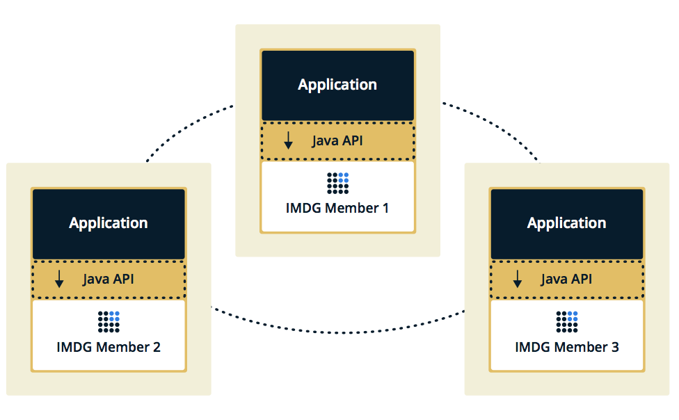
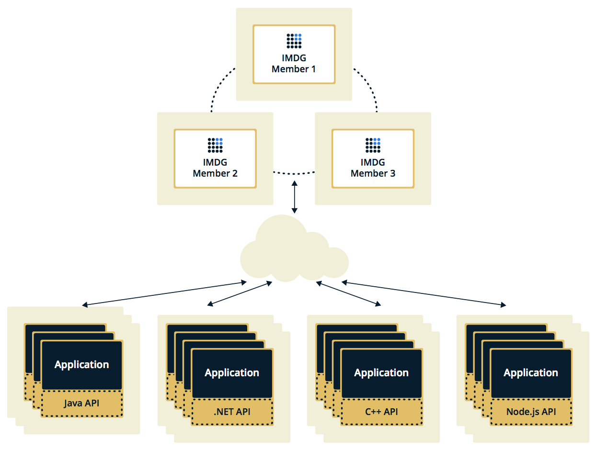

You can deploy a Hazelcast cluster in two ways: Embedded or Client/Server.

If you have an application whose main focal point is asynchronous or high performance computing and lots of task
executions, then Embedded deployment is the preferred way. In Embedded deployment, members include both the application and Hazelcast data and services. The advantage of the Embedded deployment is having a low-latency data access.

See the below illustration.

In the Client/Server deployment, Hazelcast data and services are centralized in one or more server members and they are accessed by the application through clients. 
You can have a cluster of server members that can be independently created and scaled. Your clients communicate with
these members to reach to Hazelcast data and services on them. 

See the below illustration.

Hazelcast provides native clients (Java, .NET and C++), Memcache
and REST clients, Scala, Python and Node.js client implementations.

Client/Server deployment has advantages including more predictable and reliable Hazelcast performance, easier identification of problem causes, and most importantly, better scalability. 
When you need to scale in this deployment type, just add more Hazelcast server members. You can address client and server scalability concerns separately.

If you want low-latency data access, as in the Embedded deployment, and you also want the scalability advantages of the Client/Server deployment, you can consider defining Near Caches for your clients. This enables the frequently used data to be kept in the client's local memory. Please refer to [Configuring Client Near Cache](/1600_Hazelcast_Clients/100_Java_Client/300_Configuration/800_Other_Configurations.md).

