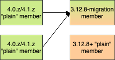
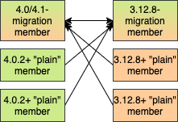
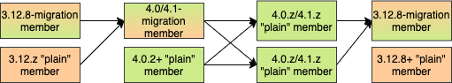

==== WAN 3.12 <-> 4.0/4.1 migration tool

This paragraph outlines a solution for migrating user data from a running 3.12 cluster to a 4.0 or 4.1 cluster and vice-versa using WAN replication.

[IMPORTANT]
====
- the WAN migration tool does not take into account migrating clients. You will have to adapt your code to use 4.x clients, run both 3.x and 4.x clients and clusters side-by-side and gradually transfer traffic from 3.x clients to 4.x clients. We will outline this solution in <<client-migration, Client Migration>>
- the tool does not provide any way to avoid recompiling code between Hazelcast 3.x and 4.x, be it code using members or client instances. It only migrates member data and does not provide any 3.x compatible API on a 4.x member or client.
- the migration tool provides a migration path from a HZ 3.12 cluster to a 4.0/4.1 cluster, not from any previous 3.x versions and not to any future 4.2+ version
- See also <<limitations-and-known-issues, Limitations and known issues>> for more limitations when using the migration tool
====

The migration tool introduces a new type of Hazelcast member instance, both for 3.12 and 4.0/4.1. We will distinguish between two types of members: "migration" and "plain" members.The "migration" members are the instances which are available as non-public releases, which will be able to accept connections and packets from members of a different major version. They will use more memory, have higher GC pressure and CPU usage in certain scenarios, all to be able to process messages from two different major versions. On the other hand, "plain" members will be the regular public releases with a minimal amount of compatibility code. To be exact, these will be public Hazelcast releases from 3.12.8 and from 4.0.2 onward. The "plain" members will not be able to accept connections and process messages from members of another major version. However, you might combine "plain" and "migration" members to form a single cluster.

In other words, "migration" members are simply new non-public Hazelcast releases which are compatible with "plain" or "regular" 3.12.z or 4.0.z members.

[#example-migration-scenarios]
===== Example migration scenarios

**Migrating 3.12 -> 4.0/4.1 (ACTIVE/PASSIVE)**

image::migration-scenario1.png[Migrating 3.12 -> 4.0/4.1]

The diagram above outlines how you can perform the migration from 3.12 to a 4.0/4.1 cluster. Below we describe the diagram and process in more details.
1. The first step is to setup the 3.12 cluster.You can also use an existing 3.12 cluster. The members of the 3.12 cluster should have a minor version of at least 3.12 but can be of any patch level. You need to setup WAN replication between the 3.12 cluster and the 4.0/4.1 cluster but this will be described soon.
2. Next, setup a 4.0/4.1 cluster. It must have at least one "migration" member and all other ("plain") members should have a patch version of at least 4.0.2. The "migration" member can also be a "lite" member while other "plain" members need not be. Making the "migration" member a "lite" member will also simplify further migration steps.
3. Add WAN replication between the two clusters. As always, this can be done using static configuration and can be added dynamically. The key point is that the 3.12 cluster needs to replicate only to the "migration" members of the 4.0/4.1 cluster. Other "plain" members are unable to process messages from 3.12 members and WAN replication must not replicate to these members. Other than that, the WAN replication configuration on the 3.12 cluster is the same as any other WAN replication towards a 3.12 cluster and no special configuration is needed.
4. After the clusters have been started and WAN replication has been added, you can use WAN sync for `IMap` or wait until enough entries have been replicated in case of `IMap` or `ICache`.
5. After enough data has been replicated to the 4.0/4.1 cluster, you can shut down the 3.12 cluster.
6. Finally, you can simply shut down the 4.0/4.1 "migration" members or do a rolling restart of these members to "plain" members.At this point, the 4.0/4.1 cluster should have only "plain" members. You can also can continue using this cluster or continue onto rolling upgrade to 4.2, for instance.

**Migrating 4.0/4.1 -> 3.12 (ACTIVE/PASSIVE)**

The diagram above outlines how you can perform the migration from 4.0/4.1 to a 3.12 cluster.The process is analogous to the 3.12 -> 4.0/4.1 migration but we will describe the diagram and process in more details below:

1. The first step is to set up the 4.0/4.1 cluster. You can also use an existing 4.0/4.1 cluster. The members of the 4.0/4.1 cluster can be of any patch level. You need to set up WAN replication between the 4.0/4.1 cluster and the 3.12 cluster but this will be described soon.
2. Next, set up a 3.12 cluster. It must have at least one "migration" member and all other ("plain") members should have a patch version of at least 3.12.8. The "migration" member can also be a "lite" member while other "plain" members need not be.Making the "migration" member a "lite" member will also simplify further migration steps.
3. Set up WAN replication between the two clusters. As always, this can be done using static configuration and can be added dynamically. The key point is that the 4.0/4.1 cluster needs to replicate only to the "migration" members of the 3.12 cluster. Other "plain" members are unable to process messages from 4.0/4.1 members and WAN replication must not replicate to these members. Other than that, the WAN replication configuration on the 4.0/4.1 cluster is the same as any other WAN replication towards a 4.0/4.1 cluster and no special configuration is needed.
4. After the clusters have been started and WAN replication has been added, you can use WAN sync for `IMap` or wait until enough entries have been replicated in case of `IMap` or `ICache`.
5. After enough data has been replicated to the 3.12 cluster, you can shut down the 4.0/4.1 cluster.
6. Finally, you can simply shut down the 3.12 "migration" members or do a rolling restart of these members to "plain" members. At this point, the 3.12 cluster should have only "plain" members.

**Migrating 3.12 <-> 4.0/4.1 (ACTIVE/ACTIVE)**

The diagram above outlines how you can perform a bi-directional migration between 3.12 and 4.0/4.1. The process is simply a combination of the first two scenarios:

1. The first step is to set up the 3.12 and 4.0/4.1 clusters. You can also use an existing clusters. The 3.12 cluster must have at least one "migration" member and the 4.0/4.1 cluster must also have at least one "migration" member.The "migration" member can also be a "lite" member while other "plain" members need not be.Making the "migration" member a "lite" member will also simplify further migration steps.Other "plain" members of the 3.12 cluster must have a patch version of at least 3.12.8 and members of the 4.0/4.1 cluster must have a patch version of at least 4.0.2.
2. Setup WAN replication between the two clusters. As always, this can be done using static configuration and can be added dynamically. The key point is that the both clusters need to replicate only to the "migration" members and not to the "plain" members as they are unable to process messages from members of another major version.Other than that, the WAN replication configuration is the same as any other regular WAN replication towards clusters of the same major version and no special configuration is needed.
3. After the clusters have been started and WAN replication has been added, you can use WAN sync for `IMap` or wait until enough entries have been replicated in case of `IMap` or `ICache`.
4. After enough data has been replicated, you can shut down either of the clusters and afterwards shut down the remaining "migration" members or do a rolling restart of these members to "plain" members

**WAN event forwarding**

Finally, we show how clusters of different major versions can be linked so that you can form complex topologies with WAN replication. The key restrictions that you need to keep in mind when combining are these:
1. If you are connecting members of different major versions, the recipient/target of the connection must be a "migration" member and not a "plain" member
2. If a cluster contains a "migration" member, it may also contain "plain" members but with the added restriction that they must be at least 3.12.8 (in case of a 3.12 cluster) or 4.0.2 (in case of a 4.0/4.1 cluster)
3. If the cluster is a source/active/sender cluster replicating towards another cluster of another major version, the source cluster must be of the minor versions 3.12, 4.0 or 4.1. The patch level is irrelevant, unless the source cluster is also a target cluster for another WAN replication, where must adhere to the first two rules

[#limitations-and-known-issues]
===== Limitations and known issues

**The "migration" member needs to be able to deserialize and serialize all received keys and values**

Since the serialized format of some classes changed between major versions, we need to deserialize and re-serialize every key and value received from a member from another major version.Otherwise, we might end up with two entries in an `IMap` for the exact same key or we might not remove an entry even though it was deleted on the source/active cluster.This is the task of the "migration" member and it means that this member needs to have the class definition for all keys and values received from clusters of another major version.On the other hand, for entries received from a cluster of the same major version, we don't need to go through this process as we are sure that the serialized format hasn't changed.This saves us from spending processing time and creating more litter for the GC to clean up.

**Issues when replicating keys and values of specific classes**

Hazelcast 4.0 introduced support for serializing some additional JDK classes with a predicatable serialized format: `CopyOnWriteArrayList`, `HashMap`, `ConcurrentSkipListMap`, `ConcurrentHashMap`, `LinkedHashMap`, `TreeMap`, `HashSet`, `TreeSet`, `LinkedHashSet`, `CopyOnWriteArraySet`, `ConcurrentSkipListSet`, `ArrayDeque`, `LinkedBlockingQueue`, `ArrayBlockingQueue`, `PriorityBlockingQueue`, `PriorityQueue`, `DelayQueue`, `SynchronousQueue`, `LinkedTransferQueue`, `UUID`, `AbstractMap.SimpleEntry`, `AbstractMap.SimpleImmutableEntry` and `LinkedBlockingDeque`. Hazelcast 3.x still may serialize some of these classes but only if they support Java Serialization. That means, if you use instances of these classes as keys or values in an IMap, you have to be sure the class can be serialized by Hazelcast 3.x as well. Otherwise, adding the key/value into the IMap may fail, either when something like `map.put` is invoked on the 3.x cluster or when such a key/value is replicated over WAN from a 4.x cluster.

Regardless, we would like to discourage use of these classes on a 3.x cluster. The output of Java serialization even for classes supporting it can be very unpredictable and can depend on the internals of the instance which are usually ignored (such as `loadFactor` for `HashMap`) or can even depend on the internals which are not under your control, such as when serializing `ArrayBlockingQueue`. Because of this, if you use these classes as keys in an IMap, you may end up with multiple entries for a seemingly same instance (e.g. two `HashMap` instances equal as reported by `equals` is serialized as two different keys).

**Issues when using merkle trees and keys and values of specific classes**

The serialized format of some classes changed between 3.12 and 4.0/4.1 and merkle trees may report that there are differences between two IMaps while in fact there is none.For WAN sync using merkle trees, this means the source cluster my transmit more entries than what is necessary to bring the two IMaps in-sync.This is not a correctness issue, and the IMaps should end up with the same contents.On the other hand, a "consistency check" might always report that the two IMaps are out-of-sync while in fact the contents of the IMaps is identical.Some examples of classes that exhibit this behaviour when used as keys or values: non-ascii `String`s and emojis, `CopyOnWriteArrayList`, `HashMap`, `ConcurrentSkipListMap`, `ConcurrentHashMap`, `LinkedHashMap`, `TreeMap`, `HashSet`, `TreeSet`, `LinkedHashSet`, `CopyOnWriteArraySet`, `ConcurrentSkipListSet`, `ArrayDeque`, `LinkedBlockingQueue`, `ArrayBlockingQueue`, `PriorityBlockingQueue`, `PriorityQueue`, `DelayQueue`, `SynchronousQueue`, `LinkedTransferQueue`, `ArrayList`, `LinkedList`, `Class`, `Date`, `BigInteger`, `BigDecimal`, `Object[]`, `Enum`s, `UUID`, `AbstractMap.SimpleEntry`, `AbstractMap.SimpleImmutableEntry` and `LinkedBlockingDeque`.See [Future improvements](#future-improvements) for an idea how this might be addressed.

**Cannot use custom merge policies based on 3.x API**

WAN replication uses merge policies to apply a change on a target cluster entry. The merge policy is configured in the source cluster and it is transferred with each WAN event batch. In Hazelcast 3.12, there were two different ways in which you can configure a merge policy - data-structure specific and data-structure agnostic.The data-structure specific interfaces are `com.hazelcast.map.merge.MapMergePolicy` and `com.hazelcast.cache.CacheMergePolicy` while the data-structure agnostic interface is `com.hazelcast.spi.merge.SplitBrainMergePolicy`. Both ways basically provide the same out-of-the-box policies as well as provide a way to implement user-defined custom merge policies.The only difference is that data-structure specific merge policies cannot be shared between different data-structure types such as `IMap` and `ICache` while the data-structure agnostic merge policy can usually be shared between all data-structures. In Hazelcast 4.0, we removed the data-structure specific merge policies. To increase the ease-of-use, 4.0 "migration" members can still receive the out-of-the-box data-structure specific merge policies (such as `com.hazelcast.map.merge.PassThroughMergePolicy`, `com.hazelcast.map.merge.PutIfAbsentMapMergePolicy`, `com.hazelcast.cache.merge.PassThroughCacheMergePolicy` etc.) and it will "translate" these merge policies into the corresponding out-of-the-box data-structure agnostic merge policies.
The only limitation that applies here is that the "migration" member cannot interpret custom, user-defined, data-structure specific merge policies. If you are using such a merge policy, you will need to switch to using a custom, user-defined, data-structure agnostic merge policy based on the `com.hazelcast.spi.merge.SplitBrainMergePolicy` interface, which should be simple enough.

[#client-migration]
===== Client Migration

With Hazelcast 4.0, in addition to all of the serialization changes done on the member-side, there were many changes in how the client connects and interacts with the cluster. On top of this, Hazelcast 4.0 introduced new features not available in 3.x and removed some features that were present in 3.x. Because of these changes it is not possible to maintain the "illusion" of connecting to a 4.x cluster with a 3.x member.

The general suggestion how to approach migrating clients between 3.x and 4.x clusters is shown in the image below.
image::client-migration.png[Client migration scenario]

As shown, the 3.x clients should stay connected to the 3.12 cluster and the 4.x clients should stay connected to the 4.0/4.1 cluster. The migration tool will ensure that the data between 3.12 and 4.0/4.1 members is in-sync. You can then gradually transfer applications from the 3.x clients to applications using 4.x clients. After all applications are using the 4.x clients and reading/writing data from/to the 4.0/4.1 members, the 3.12 cluster and the 3.x clients can be shut down.

The same suggestion applies when migrating back from 4.0/4.1 to 3.12, only with the versions reversed.